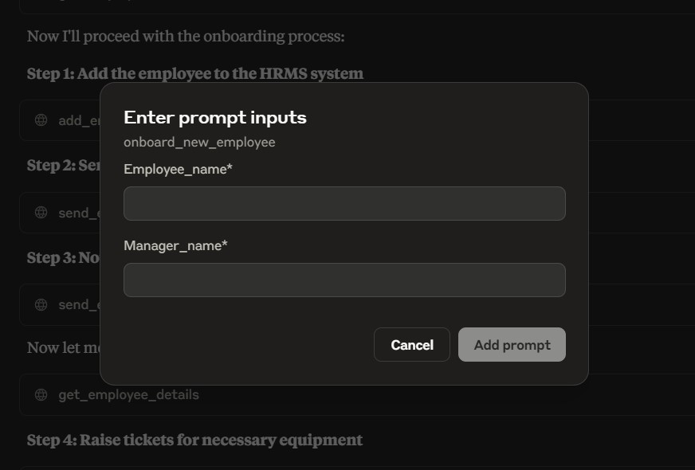

# 🤖 HR-ASSIST — Agentic AI System for HR Workflow Automation

---

## 📌 Table of Contents

1. [Problem Statement](#-problem-statement)
2. [Solution Overview](#-solution-overview)
3. [Key Features](#-key-features)
4. [System Architecture](#-system-architecture)
5. [Technology Stack](#-technology-stack)
6. [Project Structure](#-project-structure)
7. [Core Components — Deep Dive](#-core-components--deep-dive)
8. [Data Models & Schemas](#-data-models--schemas)
9. [MCP Tools Reference](#-mcp-tools-reference)
10. [Onboarding Workflow — End-to-End](#-onboarding-workflow--end-to-end)
11. [Setup & Installation](#-setup--installation)
12. [Usage](#-usage)
13. [Results & Demo](#-results--demo)
14. [Future Enhancements](#-future-enhancements)

---

## 🎯 Problem Statement

Human Resources teams across organisations spend a significant amount of time on **repetitive, manual, and error-prone workflows** — particularly during **employee onboarding**. A typical onboarding process involves:

- Registering the new hire in the HR Management System (HRMS).
- Sending welcome emails with login credentials.
- Notifying the reporting manager about the new team member.
- Raising procurement tickets for equipment (laptop, ID card, etc.).
- Scheduling introductory meetings between the employee and their manager.

Each of these steps requires switching between multiple tools (email clients, ticketing systems, calendar apps, HR portals), and missing even one step can delay a new employee's productive start by days.

**The core question this project addresses:**

> *Can we build an AI agent that autonomously orchestrates the entire onboarding process — end-to-end — using a single natural-language instruction?*

---

## 💡 Solution Overview

**HR-ASSIST** is an **Agentic AI system** built on the **Model Context Protocol (MCP)** that enables an LLM (Claude) to autonomously execute multi-step HR workflows by invoking purpose-built tools exposed by an MCP server.

Instead of manually performing each onboarding step, an HR professional simply provides a natural-language prompt (e.g., *"Onboard Rahul Verma under manager Sarah Johnson"*), and the agent:

1. **Reasons** about the required sequence of actions.
2. **Calls the appropriate tools** (add employee, send email, raise tickets, schedule meetings) in the correct order.
3. **Handles intermediate results** — uses the employee ID returned from step 1 to feed into subsequent steps.
4. **Reports the outcome** back to the user in a consolidated summary.

This transforms a **30-minute, multi-system manual process** into a **single-prompt, fully automated workflow**.

---

## ✨ Key Features

| Feature | Description |
|---|---|
| **Employee Management** | Add new employees, search by name (fuzzy matching), retrieve details, and query org hierarchy |
| **Email Automation** | Send welcome emails and manager notifications via Gmail SMTP with HTML and attachment support |
| **Ticket Management** | Create, update, and list procurement/IT tickets with status tracking (Open → In Progress → Closed) |
| **Meeting Scheduling** | Schedule, list, and cancel meetings with conflict detection |
| **Leave Management** | Check leave balances, apply for leave, and view leave history |
| **Prompt Templates** | Pre-built onboarding prompt that chains all steps into one unified workflow |
| **Seed Data** | Realistic dummy data (8 employees, org hierarchy, leave history, meetings, tickets) for instant demo |

---

## 🏗 System Architecture

```
┌─────────────────────────────────────────────────────────────────────┐
│                        USER (HR Professional)                       │
│                    "Onboard Rahul under Sarah"                      │
└──────────────────────────────┬──────────────────────────────────────┘
                               │ Natural Language Prompt
                               ▼
┌─────────────────────────────────────────────────────────────────────┐
│                     MCP CLIENT — Claude Desktop                     │
│                                                                     │
│  ┌─────────────┐  ┌──────────────┐  ┌────────────────────────────┐ │
│  │   Claude LLM │  │ Tool Router  │  │  Prompt Template Engine    │ │
│  │  (Reasoning) │◄►│ (MCP Client) │  │ (onboard_new_employee)    │ │
│  └─────────────┘  └──────┬───────┘  └────────────────────────────┘ │
└──────────────────────────┬──────────────────────────────────────────┘
                           │ MCP Protocol (stdio transport)
                           ▼
┌─────────────────────────────────────────────────────────────────────┐
│                     MCP SERVER — hr-assist                          │
│                       (server.py + FastMCP)                         │
│                                                                     │
│  ┌──────────────────────────────────────────────────────────────┐   │
│  │                      MCP Tool Layer                          │   │
│  │  add_employee │ send_email │ create_ticket │ schedule_meeting│   │
│  │  get_employee │ list_tickets│ update_ticket │ get_meetings   │   │
│  │  apply_leave  │ get_leave_balance │ get_leave_history │ ... │   │
│  └──────────┬───────────────────────────────┬───────────────────┘   │
│             │                               │                       │
│  ┌──────────▼───────────┐       ┌───────────▼──────────────────┐   │
│  │    HRMS Package       │       │     Email Module             │   │
│  │  ┌────────────────┐  │       │  ┌────────────────────────┐  │   │
│  │  │EmployeeManager │  │       │  │ EmailSender            │  │   │
│  │  │ LeaveManager   │  │       │  │ (SMTP / Gmail)         │  │   │
│  │  │ MeetingManager │  │       │  └────────────────────────┘  │   │
│  │  │ TicketManager  │  │       └──────────────────────────────┘   │
│  │  └────────────────┘  │                                          │
│  │  ┌────────────────┐  │       ┌──────────────────────────────┐   │
│  │  │ Pydantic       │  │       │     Seed Data (utils.py)     │   │
│  │  │ Schemas        │  │       │  8 employees, leave, meetings│   │
│  │  └────────────────┘  │       │  tickets — all pre-loaded    │   │
│  └──────────────────────┘       └──────────────────────────────┘   │
└─────────────────────────────────────────────────────────────────────┘
```

### How It Works

1. The user types a natural-language instruction in **Claude Desktop** (the MCP Client).
2. Claude's LLM **reasons** about which tools to call and in what order.
3. Each tool call is sent to the **MCP Server** (`server.py`) over the **stdio transport**.
4. The server executes the requested operation (CRUD on employees/tickets/meetings/leaves, or sending an email) and returns the result.
5. Claude uses the returned data (e.g., the new employee's ID) to **chain subsequent tool calls**.
6. Once all steps are complete, Claude provides a **consolidated summary** to the user.

---

## 🛠 Technology Stack

| Layer | Technology | Purpose |
|---|---|---|
| AI / LLM | **Claude (Anthropic)** | Reasoning, planning, and tool orchestration |
| Protocol | **Model Context Protocol (MCP)** | Standardised interface between LLM and tools |
| MCP Framework | **FastMCP** (`mcp[cli]`) | Python framework for building MCP servers |
| Data Validation | **Pydantic v2** | Strict schema validation for all request/response models |
| Email | **smtplib + ssl** | SMTP-based email delivery via Gmail |
| Package Manager | **uv** | Fast Python package and project management |
| Runtime | **Python ≥ 3.10** | Core language |
| Environment | **python-dotenv** | Secure credential management via `.env` |

---

## 📁 Project Structure

```
hr-assist/
├── server.py                  # MCP server — registers all tools and prompts
├── emails.py                  # EmailSender class (SMTP, TLS, attachments)
├── utils.py                   # Seed data generator for demo/testing
├── hrms/                      # Core HRMS business logic package
│   ├── __init__.py            # Package exports
│   ├── schemas.py             # Pydantic models (Employee, Leave, Meeting, Ticket)
│   ├── employee_manager.py    # Employee CRUD, search, org hierarchy
│   ├── leave_manager.py       # Leave balance, apply, history
│   ├── meeting_manager.py     # Schedule, list, cancel meetings
│   └── ticket_manager.py      # Create, update, list tickets
├── resources/
│   └── image.jpg              # Demo screenshot
├── .env                       # Environment variables (EMAIL, PASSWORD) — gitignored
├── pyproject.toml             # Project metadata and dependencies
├── .gitignore                 # Standard Python gitignore
└── README.md                  # This file
```

---

## 🔍 Core Components — Deep Dive

### 1. MCP Server (`server.py`)

The central entry point. It:
- Initialises all four manager services (`EmployeeManager`, `LeaveManager`, `MeetingManager`, `TicketManager`).
- Seeds them with realistic dummy data via `seed_services()`.
- Configures the `EmailSender` with Gmail SMTP credentials from environment variables.
- Registers **12 MCP tools** and **1 MCP prompt template** with `FastMCP`.
- Runs the server on the **stdio transport** for communication with Claude Desktop.

### 2. HRMS Package (`hrms/`)

A self-contained package with four manager classes, each responsible for a specific HR domain:

| Manager | Responsibilities |
|---|---|
| **EmployeeManager** | Add employees, auto-generate IDs (`E001`, `E002`, ...), fuzzy search by name, get details, query manager/direct-reports hierarchy |
| **LeaveManager** | Track per-employee leave balance (default: 20 days), apply for leave with balance validation, maintain leave history |
| **MeetingManager** | Schedule meetings with conflict detection, list sorted meetings, cancel by datetime + topic match |
| **TicketManager** | Create procurement/IT tickets with auto-IDs (`T0001`, `T0002`, ...), update status (Open → In Progress → Closed → Rejected), filter by employee/status |

### 3. Email Module (`emails.py`)

A reusable `EmailSender` class that supports:
- **TLS and SSL** connections.
- **HTML and plain-text** email bodies.
- **File attachments** with automatic MIME type detection.
- Configured for **Gmail SMTP** (`smtp.gmail.com:587`) but adaptable to any SMTP provider.

### 4. Seed Data (`utils.py`)

Pre-populates the system with a realistic organisational structure for immediate demo:

```
Sarah Johnson (E001) — Leadership
├── David Wilson (E003) — Engineering Lead
│   ├── Tony Sharma (E004)
│   └── James Rodriguez (E005)

Michael Chen (E002) — Leadership
├── Emily Kim (E006) — Product Lead
│   ├── Carlos Mendez (E007)
│   └── Lisa Wong (E008)
```

Also seeds randomised leave histories, upcoming meetings (next 10 days), and procurement tickets.

---

## 📐 Data Models & Schemas

All data flowing through the system is validated by **Pydantic v2 models** defined in `hrms/schemas.py`:

| Schema | Fields | Purpose |
|---|---|---|
| `EmployeeCreate` | `emp_id`, `name`, `manager_id`, `email` | Input model for adding a new employee |
| `EmployeeBase` | `emp_id`, `name`, `manager_id`, `email` | Base employee representation |
| `LeaveApplyRequest` | `emp_id`, `leave_dates` (list of dates) | Input for leave applications |
| `LeaveBalance` | `emp_id`, `balance` | Leave balance response |
| `LeaveHistoryItem` | `history_id`, `emp_id`, `leave_date`, `request_id` | Individual leave record |
| `MeetingCreate` | `emp_id`, `meeting_dt`, `topic` | Input for scheduling a meeting |
| `MeetingCancelRequest` | `emp_id`, `meeting_dt`, `topic` (optional) | Input for cancelling a meeting |
| `TicketCreate` | `emp_id`, `item`, `reason` | Input for creating a ticket |
| `TicketStatusUpdate` | `status` (Open / In Progress / Closed / Rejected) | Input for updating ticket status |

---

## 🔧 MCP Tools Reference

The server exposes the following **12 tools** to Claude via the MCP protocol:

### Employee Tools
| Tool | Parameters | Returns |
|---|---|---|
| `add_employee` | `emp_name`, `manager_id`, `email` | Confirmation message |
| `get_employee_details` | `name` (fuzzy matched) | Employee dict (ID, name, manager, email) |

### Email Tools
| Tool | Parameters | Returns |
|---|---|---|
| `send_email` | `to_emails` (list), `subject`, `body`, `html` (bool) | Confirmation message |

### Ticket Tools
| Tool | Parameters | Returns |
|---|---|---|
| `create_ticket` | `emp_id`, `item`, `reason` | Confirmation with ticket ID |
| `update_ticket_status` | `ticket_id`, `status` | Confirmation message |
| `list_tickets` | `employee_id`, `status` | List of matching tickets |

### Meeting Tools
| Tool | Parameters | Returns |
|---|---|---|
| `schedule_meeting` | `employee_id`, `meeting_datetime`, `topic` | Confirmation message |
| `get_meetings` | `employee_id` | Sorted list of meetings |
| `cancel_meeting` | `employee_id`, `meeting_datetime`, `topic` | Confirmation message |

### Leave Tools
| Tool | Parameters | Returns |
|---|---|---|
| `get_employee_leave_balance` | `emp_id` | Balance message |
| `apply_leave` | `emp_id`, `leave_dates` (list) | Application status message |
| `get_leave_history` | `emp_id` | Formatted leave history |

### Prompt Template
| Prompt | Parameters | Purpose |
|---|---|---|
| `onboard_new_employee` | `employee_name`, `manager_name` | Chains all onboarding steps into a single automated workflow |

---

## 🔄 Onboarding Workflow — End-to-End

When the `onboard_new_employee` prompt is triggered, the agent executes the following steps **autonomously**:

```
Step 1 ─► ADD EMPLOYEE
          │  Tool: add_employee(name, manager_id, email)
          │  Result: Employee created → emp_id = "E009"
          ▼
Step 2 ─► SEND WELCOME EMAIL
          │  Tool: send_email(to=[employee_email], subject, body)
          │  Result: Welcome email sent with login credentials
          ▼
Step 3 ─► NOTIFY MANAGER
          │  Tool: send_email(to=[manager_email], subject, body)
          │  Result: Manager notified about new team member
          ▼
Step 4 ─► RAISE EQUIPMENT TICKETS
          │  Tool: create_ticket(emp_id, "Laptop", "New hire setup")
          │  Tool: create_ticket(emp_id, "ID Card", "New hire setup")
          │  Tool: create_ticket(emp_id, "Other Equipment", "New hire setup")
          │  Result: Tickets T0016, T0017, T0018 created
          ▼
Step 5 ─► SCHEDULE INTRODUCTORY MEETING
          │  Tool: schedule_meeting(emp_id, datetime, "Introduction with Manager")
          │  Result: Meeting scheduled
          ▼
Step 6 ─► SUMMARY REPORT
             Agent provides a consolidated onboarding report to the user
```

**Key Insight:** The agent autonomously resolves dependencies — e.g., it first looks up the manager's email before notifying them, and uses the newly generated employee ID across all subsequent steps.

---

## ⚙ Setup & Installation

### Prerequisites

- **Python ≥ 3.10**
- **[uv](https://docs.astral.sh/uv/)** — fast Python package manager
- **[Claude Desktop](https://claude.ai/download)** — Anthropic's desktop app (MCP client)
- A **Gmail account** with an [App Password](https://support.google.com/accounts/answer/185833) enabled

### Step 1: Clone the Repository

```bash
git clone <repository-url>
cd hr-assist
```

### Step 2: Initialise the Project

```bash
uv init
uv add mcp[cli]
```

### Step 3: Configure Environment Variables

Create a `.env` file in the project root:

```env
your_email=your.email@gmail.com
your_email_password=your_gmail_app_password
```

> ⚠️ **Important:** Use a Gmail **App Password**, not your regular Gmail password. Generate one at [Google App Passwords](https://myaccount.google.com/apppasswords).

### Step 4: Configure Claude Desktop

Open your `claude_desktop_config.json` and add the following server configuration:

```json
{
  "mcpServers": {
    "hr-assist": {
      "command": "C:\\Users\\<your-username>\\.local\\bin\\uv",
      "args": [
        "--directory",
        "C:\\path\\to\\hr-assist",
        "run",
        "server.py"
      ],
      "env": {
        "EMAIL": "your.email@gmail.com",
        "EMAIL_PWD": "your_gmail_app_password"
      }
    }
  }
}
```

> Replace the `command` path with your actual `uv.exe` location and the `--directory` path with your project directory.

### Step 5: Install the MCP Server

```bash
uv run mcp install server.py
```

This registers the server with Claude Desktop so it appears in the tool picker.

---

## 🚀 Usage

### Option 1: Using the Pre-Built Onboarding Prompt

1. Open **Claude Desktop**.
2. Click the **`+`** icon in the chat input area.
3. Select **"Add from hr-assist"** → choose the `onboard_new_employee` prompt.
4. Fill in the required fields:
   - **Employee Name** — e.g., `Rahul Verma`
   - **Manager Name** — e.g., `Sarah Johnson`
5. Send the prompt.



### Option 2: Free-Form Natural Language

You can also type any HR-related instruction directly, for example:

- *"Onboard a new employee named Priya Patel under David Wilson. Her email is priya.patel@atliq.com"*
- *"What is Tony Sharma's leave balance?"*
- *"Schedule a meeting between E004 and E006 tomorrow at 2 PM about the Q3 roadmap"*
- *"Raise a ticket for a new monitor for James Rodriguez"*
- *"Show me all open tickets"*

The agent will reason about which tools to invoke and execute them automatically.

---

## 📊 Results & Demo

### What the Agent Achieves

When given the onboarding instruction, Claude autonomously:

| Step | Action | Outcome |
|---|---|---|
| 1 | Adds the employee to HRMS | New employee record created with auto-generated ID |
| 2 | Sends welcome email | Employee receives credentials at their email |
| 3 | Notifies the manager | Manager is informed via email about the new hire |
| 4 | Raises equipment tickets | Laptop, ID Card, and other equipment tickets created |
| 5 | Schedules intro meeting | Calendar meeting set between employee and manager |
| 6 | Reports back | Consolidated summary with all actions and IDs |

### What Makes This Agentic

- **Autonomous Multi-Step Execution** — The agent doesn't just answer questions; it takes a sequence of actions across multiple tools without human intervention between steps.
- **Dynamic Data Flow** — Intermediate results (employee ID, manager email) flow automatically between tool calls.
- **Error Handling** — Fuzzy name matching, duplicate detection, conflict checking, and balance validation are all handled gracefully.
- **Extensible** — New tools can be added by simply defining a function with `@mcp.tool()` — no changes to the client required.

---

## 🚧 Future Enhancements

- **Persistent Database** — Replace in-memory stores with SQLite/PostgreSQL for production use.
- **Authentication & RBAC** — Role-based access control for HR admins vs. employees.
- **Slack/Teams Integration** — Send notifications via workplace chat instead of email.
- **Approval Workflows** — Manager approval for leave requests and equipment procurement.
- **Dashboard UI** — A web-based dashboard for visualising employee data, tickets, and meetings.
- **Multi-LLM Support** — Extend the MCP server to work with GPT-4, Gemini, or other LLMs that support MCP.

---

## 👤 Author

**Siba Narayana Parida**
🎓 NIT Rourkela
📧 [sibasuper278@gmail.com](mailto:sibasuper278@gmail.com)
🔗 [LinkedIn](https://www.linkedin.com/in/sibanarayanaparida007)

